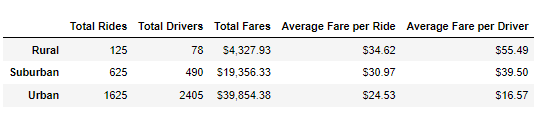
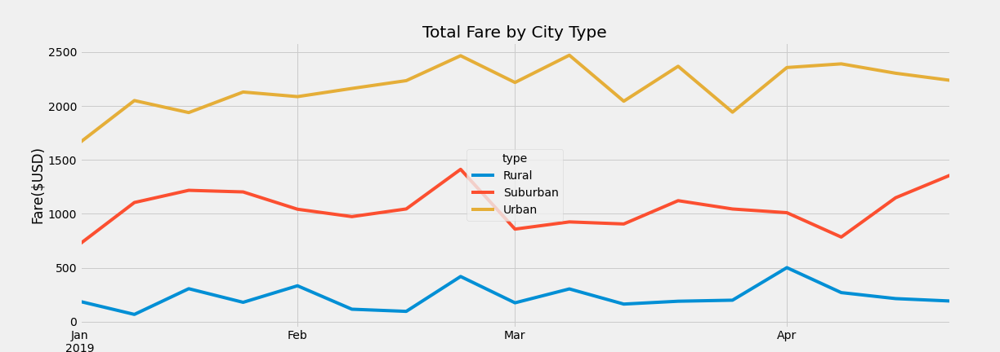
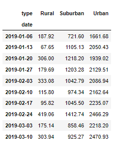

# PyBer_Analysis
## An exploratory analysis of ride-sharing data using Python and the Matplotlib, SciPy, Pandas, NumPy dependencies. 

### Resources
* Data Source: city_data.csv, ride_data.csv
* Software: Python 3.7.7, Anaconda Navigator 1.9.12, Anaconda 4.8.4, Jupyter Notebook 6.0.3 (Dependencies: Matplotlib, SciPy, Pandas, and NumPy)

### Project overview

This analysis explores and visualizes PyBer ride-sharing data from 2019 to investigate ways to improve access to ride-sharing services and assess affordability for underserved neighborhoods. The dataset provided for this analysis includes the city name, date and time of the ride, ride fare, ride ID number, number of drivers in the city, and city type. Analyzed below is the relationship between fares and city types using visualizations created using Python with Matplotlib, Pandas, and Numpy dependencies in Jupyter Notebook.

### Results

The dataframe below displays the total rides, total drivers, total fares, average fare per ride, and average fare per driver by city type. This dataframe was created using the Pandas Groupby(), count() and sum() functions. The data was assigned to functions and reformatted into the table below and displays predictable results, likely accessability driven, following the trends of other ride-sharing data available. In this visualization, the rural cities account for the least amount of rural rides, drivers and fares; however, have the highest fares per rides and drivers. As the city size increases, rides and drivers do similarly and we see the fare per ride and driver decrease. 

The same data can be viewed below in a bubble chart format 

The linechart below visualizes the total fare by city type throughout the months of January to April of 2019. This visualization was created using the pivot(), loc and resample functions and shows the viewer the fares by city types over time. By viewing the data in this format, a week by week picture is created that can aid in  forecasting revenue, planning rates, and understanding what improvements can be made to increase availability to disadvantaged areas. A noteworthy peak in fares during the month of February is observed in all city types that would be beneficial to further analyze but overall, it is evident that all city types experience similar peak and fall times throughout the year on greater and smaller scales.   

Below, the same data is viewable in a dataframe: 

### Conclusion

To improve ride-sharing access to the underserved rural areas, the mileage rate in rural areas could be decreased to promote affordability. Potential riders may be more inclined to use the services and increased usage may make up for the loss caused by the reduced mileage rate. Fees could be applied to the urban and suburban areas to make up for any outstanding loss from the rural cities. These fees could include charging more per mile on shorter rides in more populated areas or charging more per number of riders. Additional recomendations could be made if demographics were provided within the dataset analyzed. 
